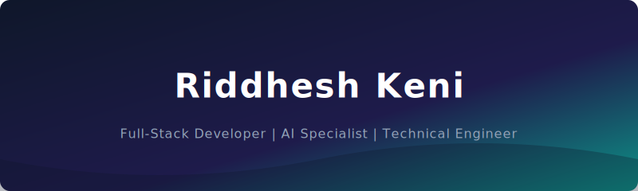

# 

  

  
  
  

  
  

  Welcome to my digital workspace. I am a Computer Science student and Full-Stack Developer specializing in building high-quality, secure, and responsive web applications with integrated Artificial Intelligence models.

### 🕹️ THE ARCADE PORTAL

In addition to system engineering, I love classic game mechanics. Try out this fully playable HTML5 recreation of Super Mario directly in your browser.

  

  

### 🛠️ TECHNICAL CAPABILITIES & TOOLKIT

| Category | Technologies |
| :--- | :--- |
| **Programming Languages** |       |
| **Frameworks & Libraries** |      |
| **Databases & AI** |     |
| **Tools & Platforms** |       |
| **Spoken Languages** | English (Professional Working) \| Hindi (Professional Working) \| Marathi (Native) |

### 💼 PROFESSIONAL CHRONOLOGY

#### Regnex | Technical Engineer
*June 2024 – Present*
*   Coordinated feature engineering and optimization protocols on the platform.
*   Conducted software diagnostics and bug resolution alongside SMEs and product leads.
*   Implemented QA and platform test processes to ensure feature stability.

#### Freelance Projects | Full-Stack Web Developer
*March 2023 – Present*
*   Designed, built, and deployed robust web portals for real clients end-to-end.
*   Key deployments include: Balaji Farm Stay, Riverside Farm, and Yamuna Enterprises.

#### Leadership & Event Operations | Coordinator
*Academic Years 2022 – 2024*
*   Organized a job fair for **2,000+ candidates** and coordinated recruiting with **40+ corporate firms**.
*   Elected Coordinator for technical and cultural festivals at Annasaheb Vartak College.

### 🚀 PROJECTS & CAMPAIGNS

*   **🏥 [InstaHealth](https://github.com/riddheshkeni777-beep/Instahealth)**
    *An AI-integrated healthcare system that streamlines medical report analysis, doctor consultations, and medicine alternatives.*
    `React` `Node.js` `MongoDB` `AI APIs`

*   **🔍 [Veracity](https://github.com/riddheshkeni777-beep/Veracity)**
    *An intelligent credibility assessment tool using AI language models to identify news validation metrics.*
    `AI APIs` `JavaScript` `Web Technologies`

*   **🏋️ [Goddev Gym](https://github.com/riddheshkeni777-beep/GYM-website)**
    *A responsive business landing page detailing schedules, fitness programs, and membership registrations.*
    `HTML5` `CSS3` `Vanilla JS`

### 🎓 CERTIFICATIONS

*   🤖 **Machine Learning Mastery** — *Microsoft Student Chapter GNIT*
*   📊 **Process Mining Rising Star** — *Celonis*
*   💡 **Claude Code in Action** — *Anthropic*
*   💡 **Claude 101 & AI Fluency for Students** — *Anthropic*
*   💻 **Software Engineer Intern** — *HackerRank*
*   🧬 **Machine Learning Concepts** — *DevTown*
*   ☕ **Python, SQL & JavaScript (Basic)** — *HackerRank*
*   🎨 **Design Systems 101** — *edQuest*

### 📊 ANALYTICS & METRICS

#### 📅 3D Contribution Calendar

  

#### 📊 Core Metrics

  
  

### ✉️ CONNECT WITH ME

  
  
  

