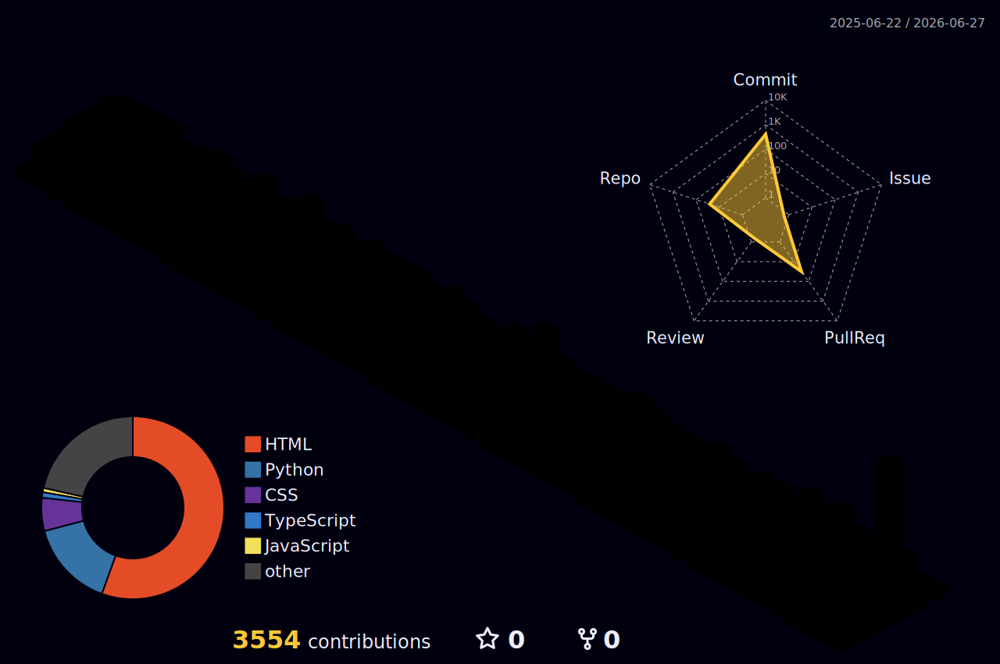

<div align="center">

<!-- ANIMATED HEADER BANNER -->


<br/>

<!-- TYPING ANIMATION -->
<a href="https://git.io/typing-svg">
  
</a>

<br/><br/>

<!-- PROFILE BADGES -->
<a href="mailto:riddheshkeni777@gmail.com">
  
</a>
<a href="https://www.linkedin.com/in/riddhesh-keni-46b21b37a/">
  
</a>
<a href="https://x.com/NotRiddhesh">
  
</a>
<a href="https://riddheshkeniportfolio.netlify.app">
  
</a>

<br/><br/>


</div>

---

<div align="center">

## 👨‍💻 ABOUT ME

</div>

<table>
<tr>
<td width="55%">

```javascript
const riddhesh = {
  name     : "Riddhesh Keni",
  role     : "Full-Stack Developer & AI Specialist",
  location : "Mumbai, Maharashtra 🇮🇳",
  education: "B.Sc. Computer Science",
  //         Annasaheb Vartak College

  currentWork: "Technical Engineer @ Regnex",

  passion: [
    "Web Development",
    "AI Integration",
    "Open Source",
    "System Design"
  ],

  spokenLanguages: [
    "English (Professional)",
    "Hindi  (Professional)",
    "Marathi (Native)"
  ],

  funFact: "Organized a job fair for 2000+ people! 🎯",
  goal   : "Building AI products that matter ✨"
};
```

</td>
<td width="45%" align="center">


<br/>


</td>
</tr>
</table>

---

<div align="center">

## 🎮 PLAY SUPER MARIO — LIVE IN YOUR BROWSER!

*A fully playable retro Super Mario experience! Click below to launch the game.*

<br/>

<a href="https://pratikpatel8982.github.io/mario-riddhesh/" target="_blank">
  
</a>

<br/>

[](https://pratikpatel8982.github.io/mario-riddhesh/)

<br/>


</div>

---

<div align="center">

## 🛠️ TECH STACK & SKILLS

</div>

### 💻 Programming Languages

<div align="center">


</div>

### ⚛️ Frameworks & Libraries

<div align="center">


</div>

### 🗄️ Databases & AI Platforms

<div align="center">


</div>

### 🔧 Developer Tools & Platforms

<div align="center">


</div>

### 🌐 Spoken Languages

<div align="center">


</div>

---

<div align="center">

## 📊 GITHUB ANALYTICS

</div>

<div align="center">


</div>

<br/>

<div align="center">


</div>

<br/>

<div align="center">

### 🏆 GitHub Trophies


</div>

---

<div align="center">

## 💼 PROFESSIONAL EXPERIENCE

</div>

<table width="100%">
<tr>
<td>

### 🏢 Technical Engineer — **Regnex**
**`📅 June 2024 – Present`** &nbsp;|&nbsp; 📍 Mumbai, India

- 🔧 Coordinated feature engineering and platform optimization protocols
- 🐛 Conducted software diagnostics and bug resolution alongside SMEs and product leads
- ✅ Implemented QA processes and platform testing to ensure feature stability

</td>
</tr>
<tr>
<td>

### 💻 Full-Stack Web Developer — **Freelance**
**`📅 March 2023 – Present`** &nbsp;|&nbsp; 🌍 Remote

- 🌐 Designed, built, and deployed robust web portals for real clients end-to-end
- 🏡 Key deployments: **Balaji Farm Stay**, **Riverside Farm**, **Yamuna Enterprises**
- 📈 Delivered responsive, performance-optimized production applications

</td>
</tr>
<tr>
<td>

### 🎓 Event Coordinator — **Annasaheb Vartak College**
**`📅 Academic Years 2022 – 2024`** &nbsp;|&nbsp; 📍 Mumbai, India

- 🎯 Organized a job fair for **2,000+ candidates** with **40+ corporate firms**
- 🏆 Elected Coordinator for technical and cultural festivals
- 👥 Led cross-functional teams for large-scale campus events

</td>
</tr>
</table>

---

<div align="center">

## 🚀 FEATURED PROJECTS

</div>

<div align="center">

<a href="https://github.com/riddheshkeni777-beep/Instahealth">
  
</a>
<a href="https://github.com/riddheshkeni777-beep/Veracity">
  
</a>

</div>

<br/>

<div align="center">

<a href="https://github.com/riddheshkeni777-beep/GYM-website">
  
</a>

</div>

<br/>

| 🌟 | Project | Description | Stack | Status |
|:--:|:--------|:------------|:------|:------:|
| 🏥 | **[InstaHealth](https://github.com/riddheshkeni777-beep/Instahealth)** | AI-powered healthcare platform for medical report analysis & doctor consultations | `React` `Node.js` `MongoDB` `OpenAI API` | ✅ Live |
| 🔍 | **[Veracity](https://github.com/riddheshkeni777-beep/Veracity)** | AI-driven news credibility assessment & intelligent fact-checking tool | `JavaScript` `Claude AI` `REST APIs` | ✅ Live |
| 🏋️ | **[Goddev Gym](https://github.com/riddheshkeni777-beep/GYM-website)** | Responsive business landing page with schedules, programs & memberships | `HTML5` `CSS3` `Vanilla JS` | ✅ Live |
| 🏡 | **Balaji Farm Stay** | Full-stack hospitality & farm stay booking web portal | `React` `Node.js` `MongoDB` | ✅ Deployed |
| 🌊 | **Riverside Farm** | Nature resort website with integrated booking system | `HTML5` `CSS3` `JS` | ✅ Deployed |
| 🏭 | **Yamuna Enterprises** | Corporate web presence with product catalogue | `React` `Tailwind CSS` | ✅ Deployed |

---

<div align="center">

## 🎓 CERTIFICATIONS & ACHIEVEMENTS

| 🏅 Certification | 🏢 Issuer | 📂 Domain |
|:-----------------|:----------|:---------|
| 🤖 Machine Learning Mastery | Microsoft Student Chapter GNIT | AI & ML |
| 📊 Process Mining Rising Star | Celonis | Data Analytics |
| 💡 Claude Code in Action | Anthropic | AI Engineering |
| 💡 Claude 101 & AI Fluency for Students | Anthropic | AI Literacy |
| 💻 Software Engineer Intern Certification | HackerRank | Engineering |
| 🧬 Machine Learning Concepts | DevTown | AI & ML |
| ☕ Python, SQL & JavaScript (Basic) | HackerRank | Programming |
| 🎨 Design Systems 101 | edQuest | UI/UX Design |

</div>

---

<div align="center">

## 🌈 3D CONTRIBUTION GRAPH



</div>

---

<div align="center">

## 🐍 CONTRIBUTION SNAKE ANIMATION

<picture>
  <source media="(prefers-color-scheme: dark)" srcset="https://raw.githubusercontent.com/riddheshkeni777-beep/riddheshkeni777-beep/output/github-snake-dark.svg" />
  <source media="(prefers-color-scheme: light)" srcset="https://raw.githubusercontent.com/riddheshkeni777-beep/riddheshkeni777-beep/output/github-snake.svg" />
  
</picture>

</div>

---

<div align="center">

## ✉️ LET'S CONNECT & BUILD TOGETHER

<br/>

<a href="mailto:riddheshkeni777@gmail.com">
  
</a>

<a href="https://www.linkedin.com/in/riddhesh-keni-46b21b37a/">
  
</a>

<a href="https://riddheshkeniportfolio.netlify.app">
  
</a>

<a href="https://x.com/NotRiddhesh">
  
</a>

<br/><br/>

> *"The best way to predict the future is to build it."*

<br/>


</div>
